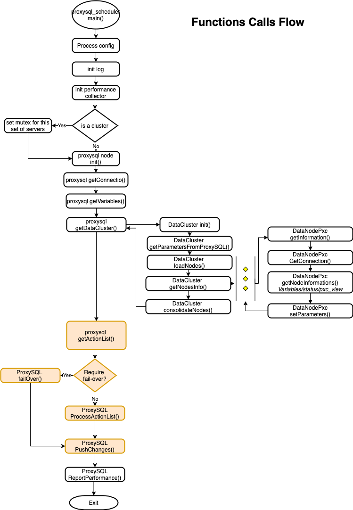

# proxysql_scheduler

##Initialize the environment  

###create entry in pxc_clusters table
`insert into disk.pxc_clusters (cluster_id,hg_w,hg_r,bck_hg_w,bck_hg_r,max_writers,retry_down) values (1,100,101,8100,8101,3,2);`

###Details

