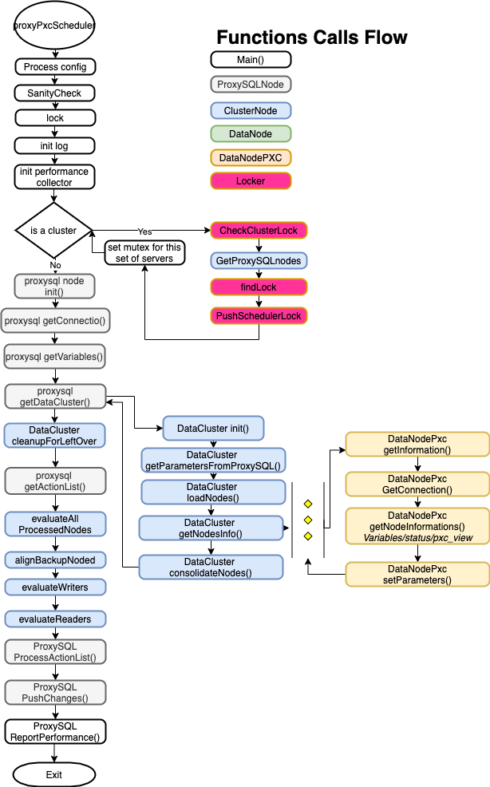
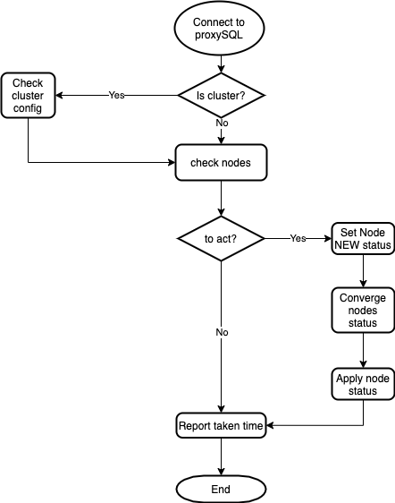
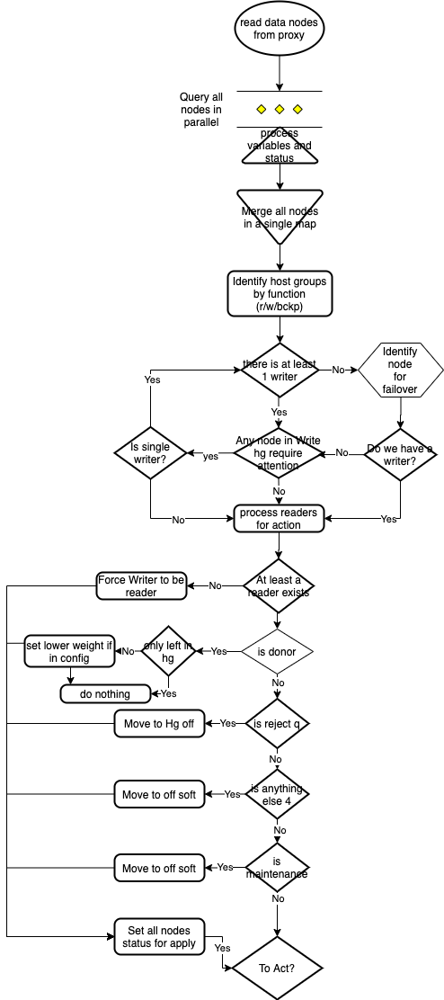

- [Concept](#concept)
  * [Understand the HGs relation](#understand-the-hgs-relation)
  * [Failover](#failover)
  * [Failback](#failback)
  * [Other notes about how nodes are managed](#other-notes-about-how-nodes-are-managed)
- [Working with ProxySQL cluster](#working-with-proxysql-cluster)
  * [Related Parameters](#related-parameters)
  * [Example of proxySql setup](#example-of-proxysql-setup)
- [How to configure PXC Scheduler Handler](#how-to-configure-pxc-scheduler-handler)
  * [Global](#global)
  * [ProxySQL](#proxysql)
  * [Pxccluster](#pxccluster)
    + [Persist Primary Values](#persist-primary-values)
    + [Specify custom Configuration and Maintenance Hostgroups](#specify-custom-configuration-and-maintenance-hostgroups)
    + [Use of max_replication_lag to handle Desync state](#use-of-max-replication-lag-to-handle-desync-state)
- [Examples of configurations in ProxySQL](#examples-of-configurations-in-proxysql)
- [Logic Rules used in the check](#logic-rules-used-in-the-check)
- [Security settings](#security-settings)
- [Download and compile from source](#download-and-compile-from-source)
- [Release Notes](#release-notes)
- [Details](#details)

## Concept
PXC Scheduler Handler is an application that can run as standalone or invoked from ProxySQL scheduler. Its function is to manage integration between ProxySQL and Galera (from Codership), including its different implementations like PXC.
The scope of PXC Scheduler Handler is to maintain the ProxySQL mysql_server table, in a way that the PXC cluster managed will suffer of minimal negative effects due to possible data node: failures, service degradation and maintenance.

PXC Scheduler Handler is also ProxySQL cluster aware and can deal with multiple instances running on more ProxySQL cluster nodes. When in presence of a cluster the application will attempt to set a lock at cluster level such that no other node will interfere with the actions.

At the moment galera_check analyze and manage the following:

Node states:
 * pxc_main_mode
 * read_only
 * wsrep_status
 * wsrep_rejectqueries
 * wsrep_donorrejectqueries
 * wsrep_connected
 * wsrep_desinccount
 * wsrep_ready
 * wsrep_provider
 * wsrep_segment
 * Number of nodes in by segment
 * Retry loop
 * PXC cluster state:

It also makes possible to isolate the Primary Writer from READS (when read/write split is in place in ProxySQL), such that reads will be redirect only to READ HostGroup.

### Understand the HGs relation
PXC Scheduler Handler leverage the HostGroup concept existing in ProxySQL to identify 3 main set of HGs, the set that needs to be handled (your pair of HGs for R/W) , the set used for configuration (the ones in the 8XXX range) and a special set use to isolate the nodes when not active (in the 9XXX range).

To clarify, let assume you have your PXC cluster compose by 3 Nodes, and you have already set query rules to split traffic R/W with the following HGs:
* 10 is the ID for the HG dealing with Writes
* 11 is the ID for the HG dealing with Reads

What you need to add is 2 CONFIGURATION HGs that as ID have the ID from your HG + 8000.
In our example:
* 8010 is the ID for the configuration HG for HG 10
* 8011 is the ID for the configuration HG for HG 11

The settings used in the 8XXX HGs like weight, use of SSL etc. are used as templates when in the need to deal with the nodes in the managed HGs (10, 11). This is it, settings in 8010/11 are persistent, the ones in 10/11 are not.


### Failover
A fail-over will occur anytime a Primary writer node will need to be demoted. This can be for planned maintenance as well as a node crash. To be able to fail-over PXC Scheduler Handler require to have valid Node(s) in the corresponding 8XXX HostGroup (8000 + original HG id).
Given that assume we have:
```editorconfig
node4 : 192.168.4.22 Primary Writer
node5 : 192.168.4.23
node6 : 192.168.4.233
```
If node4 will fail/maintenance,  PXC Scheduler Handler will choose the next one with higher weight in the 8XXX corresponding HGs.
Actions will also be different if the Node is going down because a crash or maintenance. In case of the latter the Node will be set as OFFLINE_SOFT to allow existing connections to end their work. In other cases, the node will be moved to HG 9XXX which is the special HG to isolate non active nodes.

### Failback
PXC Scheduler Handler by default IS NOT doing failback, this is by design. Nevertheless, if the option is activated in the config file, PXC Scheduler Handler will honor that.
What is a failback? Assume you have only ONE writer (Primary writer) elected because its weight is the highest in the 8XXX writer HG. If this node is removed another will take its place. When the original Node will come back and failback is active, this node will be re-elected as Primary, while the one who take its place is moved to OFFLINE_SOFT.
Why failback is bad? Because with automatic failback, your resurrecting node will be immediately move to production. This is not a good practice when in real production environment, because normally is better to warmup the Buffer-Pool to reduce the access to storage layer, and then move the node as Primary writer.

### Other notes about how nodes are managed
If a node is the only one in a segment, the check will behave accordingly. IE if a node is the only one in the MAIN segment, it will not put the node in OFFLINE_SOFT when the node become donor to prevent the cluster to become unavailable for the applications. As mention is possible to declare a segment as MAIN, quite useful when managing prod and DR site.

The check can be configure to perform retry in a X interval. Where X is the time define in the ProxySQL scheduler. As such if the check is set to have 2 retry for UP and 4 for down, it will loop that number before doing anything.

This feature is very useful in some not well known cases where Galera behave weird. IE whenever a node is set to READ_ONLY=1, galera desync and resync the node. A check not taking this into account will cause a node to be set OFFLINE and back for no reason.


## Working with ProxySQL cluster
Working with ProxySQL cluster is a real challenge give A LOT of things that should be there are not.

ProxySQL do not even has idea if a ProxySQL cluster node is up or down. To be precise it knows internally but do not expose this at any level, only as very noisy log entry.
Given this the script must not only get the list of ProxySQL nodes but validate them.

In terms of checks we do:
We check if the node were we are has a lock or if can acquire one.
If not we will return nil to indicate the program must exit given either there is already another node holding the lock or this node is not in a good state to acquire a lock.
All the DB operations are done connecting locally to the ProxySQL node running the scheduler.

Find lock method review all the nodes existing in the Proxysql for an active Lock it checks only nodes that are reachable.
Checks for:
- an existing lock locally
- lock on another node
- lock time comparing it with lockclustertimeout parameter

### Related Parameters

```editorconfig
[proxysql]
clustered = true

[global]
lockfiletimeout = 60 #seconds 
lockclustertimeout = 600 # seconds
```
Last important thing. When using Proxysql in cluster mode the address indicated in the `[proxysql]` section `host` __MUST__ be the same reported in the `proxysql_servers` table or the cluster operations will fail.
The user/password as well must be the same used for the cluster, or be able to access proxysql from another node (admin/admin will not work).

ProxySQL Documentation reports:
```
TODO
 - add support for MySQL Group Replication
 - add support for Scheduler
Roadmap
This is an overview of the features related to clustering, and not a complete list. None the following is impletemented yet.
Implementation may be different than what is listed right now:
 - support for master election: the word master was intentionally chosen instead of leader
 - only master proxy is writable/configurable
 - implementation of MySQL-like replication from master to slaves, allowing to push configuration in real-time instead of pulling it
 - implementation of MySQL-like replication from master to candidate-masters
 - implementation of MySQL-like replication from candidate-masters to slaves
 - creation of a quorum with only candidate-masters: normal slaves are not part of the quorum
```
None of the above is implemented


### Example of proxySql setup 

__Very Important Note:__
PXC_scheduler_Handler, is a replacement of the native Proxysql galera support. 
As such __ANY__ reference to the hostgroup that you are going to manage with it, __MUST__ be removed from the table :`mysql_galera_hostgroup.`
Following the example below, the `mysql_galera_hostgroups` table must not have entries for hostgroups 100,101,8100,8101,9100,9101. If you keep that then the two products will collide with unexpected results. 

Assuming we have 3 nodes:
- node4 : `192.168.4.22`
- node5 : `192.168.4.23`
- node6 : `192.168.4.233`

As Hostgroup:
- HG 100 for Writes
- HG 101 for Reads
We have to configure also nodes in 8XXX:
- HG 8100 for Writes 
- HG 8101 for Reads

We will need to :
```MySQL
delete from mysql_servers where hostgroup_id in (100,101,8100,8101);
INSERT INTO mysql_servers (hostname,hostgroup_id,port,weight,max_connections,comment) VALUES ('192.168.4.22',100,3306,1000,2000,'Preferred writer');
INSERT INTO mysql_servers (hostname,hostgroup_id,port,weight,max_connections,comment) VALUES ('192.168.4.23',100,3306,999,2000,'Second preferred ');
INSERT INTO mysql_servers (hostname,hostgroup_id,port,weight,max_connections,comment) VALUES ('192.168.4.233',100,3306,998,2000,'Las chance');
INSERT INTO mysql_servers (hostname,hostgroup_id,port,weight,max_connections,comment) VALUES ('192.168.4.22',101,3306,998,2000,'last reader');
INSERT INTO mysql_servers (hostname,hostgroup_id,port,weight,max_connections,comment) VALUES ('192.168.4.23',101,3306,1000,2000,'reader1');    
INSERT INTO mysql_servers (hostname,hostgroup_id,port,weight,max_connections,comment) VALUES ('192.168.4.233',101,3306,1000,2000,'reader2');        

INSERT INTO mysql_servers (hostname,hostgroup_id,port,weight,max_connections,comment) VALUES ('192.168.4.22',8100,3306,1000,2000,'Failover server preferred');
INSERT INTO mysql_servers (hostname,hostgroup_id,port,weight,max_connections,comment) VALUES ('192.168.4.23',8100,3306,999,2000,'Second preferred');    
INSERT INTO mysql_servers (hostname,hostgroup_id,port,weight,max_connections,comment) VALUES ('192.168.4.233',8100,3306,998,2000,'Thirdh and last in the list');      

INSERT INTO mysql_servers (hostname,hostgroup_id,port,weight,max_connections,comment) VALUES ('192.168.4.22',8101,3306,998,2000,'Failover server preferred');
INSERT INTO mysql_servers (hostname,hostgroup_id,port,weight,max_connections,comment) VALUES ('192.168.4.23',8101,3306,999,2000,'Second preferred');    
INSERT INTO mysql_servers (hostname,hostgroup_id,port,weight,max_connections,comment) VALUES ('192.168.4.233',8101,3306,1000,2000,'Thirdh and last in the list');      


LOAD MYSQL SERVERS TO RUNTIME; SAVE MYSQL SERVERS TO DISK;    

```
Will create entries in ProxySQL for 2 main HG (100 for write and 101 for read) It will also create 3 entries for the SPECIAL group 8100 and other 3 for HG 8101. As already mention above these groups will be used by the application to manage all the mysql_servers table maintenance operation.

In the above example, what will happen is that if you have set active_failover=1, the application will check the nodes, if node 192.168.4.22',100 is not up, the application will try to identify another node within the same segment that has the higest weight IN THE 8100 HG. In this case it will elect as new writer the node'192.168.4.23',8100.

Please note that active_failover=1, is the only deterministic method to failover, based on what YOU define. If set correctly across a ProxySQL cluster, all nodes will act the same.


## How to configure PXC Scheduler Handler
There are many options that can be set, and I foresee we will have to add even more. Given that I have abandoned the previous style of using command line and move to config-file definition. Yes this is a bit more expensive, given the file access but it is minimal.
Keep in mind I am following the CamelCase go standard, for variables and configuration variables as well.
Said that, the variables in the configuration file are not case sensitive.
Given that `singlePrimary` or `Singleprimary` or `singleprimary` will be the same. But I suggest you to keep the CamelCase. 

First let us see what we have:
- 3 sections
    - Global 
    - pxccluster
    - proxysql
    
### Global
```[global]
logLevel = "debug"
logTarget = "stdout" #stdout | file
logFile = "/Users/marcotusa/work/temp/pscheduler.log"
daemonize = true
daemonInterval = 2000
performance = true
OS = "na"
```

- daemonize : [false] Will allow the script to run in a loop without the need to be call by ProxySQL scheduler 
- daemonInterval : Define in ms the time for looping when in daemon mode
- loglevel : [info] options are: `[error,warning,info,debug]` Define the log level to be used. When using `debug` it will print additional information on the execution, and it can be very verbose.  
- logTarget : [stdout] Can be either a file or stdout 
- logFile : In case file for logging define the target 
- OS : for future use
- lockfiletimeout : Time ins seconds after which the file lock is considered expired [local instance lock]
- lockclustertimeout : Time in seconds after which the cluster lock is considered expired
- performance : boolean which enable the statistic reporting. If you do not want any reporting just set to `false`. By default, is true which means when log is set as `error` or `warning` you still have: `[INFO]:2022-01-12 16:57:15 - Phase: main = 83,051,000 us 83 ms`

### ProxySQL
- port : [6032] Port used to connect 
- host : [127.0.0.1] IP address used to connect to ProxySQL __IF using cluster you must match this with the IP in the proxysql_servers table__
- user : [] User able to connect to ProxySQL
- password : [] Password 
- clustered : [false] If this is __NOT__ a single instance then we need to put a lock on the running scheduler (see [Working with ProxySQL cluster](#Working-with-ProxySQL-cluster) section)
- initialized : not used (for the moment) 
- respectManualOfflineSoft : [false] When true the checker will NOT modify an `OFFLINE_SOFT` state manually set. It will also DO NOT put back any OFFLINE_SOFT given it will be impossible to discriminate the ones set by hand from the ones set by the application. Given that this feature is to be consider, __UNSAFE__ and should never be used unless you know very well what you are doing.

### Pxccluster
- activeFailover : [1] Failover method
- failBack : [false] If we should fail-back automatically or wait for manual intervention 
- checkTimeOut : [4000] This is one of the most important settings. When checking the Backend node (MySQL), it is possible that the node will not be able to answer in a consistent amount of time, due the different level of load. If this exceeds the Timeout, a warning will be print in the log, and the node will not be processed. Parsing the log it is possible to identify which is the best value for checkTimeOut to satisfy the need of speed and at the same time to give the nodes the time they need to answer.
- mainSegment : [1] This is another very important value to set, it defines which is the MAIN segment for failover
- sslClient : "client-cert.pem" In case of use of SSL for backend we need to be able to use the right credential
- sslKey : "client-key.pem" In case of use of SSL for backend we need to be able to use the right credential
- sslCa : "ca.pem" In case of use of SSL for backend we need to be able to use the right credential
- sslCertificatePath : ["/full-path/ssl_test"] Full path for the SSL certificates
- hgW : Writer HG
- hgR : Reader HG
- [ConfigHgRange](#specify-custom-configuration-and-maintenance-hostgroups) : The value that should be used to calculate the Configuration Host Groups. This was 8000 hard-coded,  and now configurable `default:8000`
- [MaintenanceHgRange](#specify-custom-configuration-and-maintenance-hostgroups) : The value that should be used to calculate the Maintenance Host Groups. This was 9000 hard-coded,  and now configurable `default:9000`
- ~~bckHgW : Backup HG in the 8XXX range (hgW + 8000)~~ DEPRECATED A warning is raised in the log
- ~~bckHgR :  Backup HG in the 8XXX range (hgR + 8000)~~ DEPRECATED A warning is raised in the log
- singlePrimary : [true] This is the recommended way, always use Galera in Single Primary to avoid write conflicts
- maxNumWriters : [1] If SinglePrimary is false you can define how many nodes to have as Writers at the same time
- writerIsAlsoReader : [1] Possible values 0 - 1. The default is 1, if you really want to exclude the writer from read set it to 0. When the cluster will lose its last reader, the writer will be elected as Reader, no matter what. 
- retryUp : [0] Number of retries the application should do before restoring a failed node
- retryDown : [0] Number of retries the application should do to put DOWN a failing node
- clusterId : 10 the ID for the cluster 
- persistPrimarySettings : [0]{0|1|2} This option allow the new elected Primary (in case of fail-over) to maintain the Primary node values for weight/connections/Max values and so on.
  (see Persist Primary section for explanation) - valid value 0|1 only Writer|2 Writer and Reader
 
#### Persist Primary Values
In pxc_scheduler_handler is possible to ask the application to keep the values assigned to the Primary Writer also when another node is elected, as in case of fail-over.<br>
There are few conditions for this to work consistently:
  - Cluster must be __Single Primary__
  - When using __Fail Back__ given the Primary will have the same weight of the node coming back, FailBack will __NOT__ automatically work.<br>

Said that you can define if you want ONLY the value for the WRITER changed, or if you want to modify also the corresponding READER.
Let us use an example to have this clear.
Given:
```sql
+--------------+---------------+------+-----------+--------+--------+-------------+-----------------+---------------------+---------+----------------+-----------------------------+
| hostgroup_id | hostname      | port | gtid_port | status | weight | compression | max_connections | max_replication_lag | use_ssl | max_latency_ms | comment                     |
+--------------+---------------+------+-----------+--------+--------+-------------+-----------------+---------------------+---------+----------------+-----------------------------+
| 100          | 192.168.4.22  | 3306 | 0         | ONLINE | 1000   | 0           | 2000            | 0                   | 0       | 0              | Preferred writer            |
| 101          | 192.168.4.22  | 3306 | 0         | ONLINE | 998    | 0           | 2000            | 0                   | 0       | 0              | last reader                 |
| 101          | 192.168.4.23  | 3306 | 0         | ONLINE | 1000   | 0           | 2000            | 0                   | 0       | 0              | reader1                     |
| 101          | 192.168.4.233 | 3306 | 0         | ONLINE | 1000   | 0           | 2000            | 0                   | 0       | 0              | reader2                     |
| 8100         | 192.168.4.22  | 3306 | 0         | ONLINE | 1000   | 0           | 2000            | 0                   | 0       | 0              | Failover server preferred   |
| 8100         | 192.168.4.23  | 3306 | 0         | ONLINE | 999    | 0           | 2000            | 0                   | 0       | 0              | Second preferred            |
| 8100         | 192.168.4.233 | 3306 | 0         | ONLINE | 998    | 0           | 2000            | 0                   | 0       | 0              | Thirdh and last in the list |
| 8101         | 192.168.4.22  | 3306 | 0         | ONLINE | 998    | 0           | 2000            | 0                   | 0       | 0              | Failover server preferred   |
| 8101         | 192.168.4.23  | 3306 | 0         | ONLINE | 1000   | 0           | 2000            | 0                   | 0       | 0              | Second preferred            |
| 8101         | 192.168.4.233 | 3306 | 0         | ONLINE | 1000   | 0           | 2000            | 0                   | 0       | 0              | Thirdh and last in the list |
+--------------+---------------+------+-----------+--------+--------+-------------+-----------------+---------------------+---------+----------------+-----------------------------+

```
If my current primary goes down, and I have `persistPrimarySettings = 1` The next primary will have:

```sql
+--------------+---------------+------+-----------+--------+--------+-------------+-----------------+---------------------+---------+----------------+-----------------------------+
| hostgroup_id | hostname      | port | gtid_port | status | weight | compression | max_connections | max_replication_lag | use_ssl | max_latency_ms | comment                     |
+--------------+---------------+------+-----------+--------+--------+-------------+-----------------+---------------------+---------+----------------+-----------------------------+
| 100          | 192.168.4.23  | 3306 | 0         | ONLINE | 1000   | 0           | 2000            | 0                   | 0       | 0              | Second preferred            |
| 101          | 192.168.4.23  | 3306 | 0         | ONLINE | 1000   | 0           | 2000            | 0                   | 0       | 0              | reader1                     |
| 8100         | 192.168.4.23  | 3306 | 0         | ONLINE | 999    | 0           | 2000            | 0                   | 0       | 0              | Second preferred            |
| 8101         | 192.168.4.23  | 3306 | 0         | ONLINE | 1000   | 0           | 2000            | 0                   | 0       | 0              | Second preferred            |
+--------------+---------------+------+-----------+--------+--------+-------------+-----------------+---------------------+---------+----------------+-----------------------------+

```
The node `192.168.4.23` will be promoted and values changed from what it has as default for the Writer, but Reader values will remain the ones defined as defaults.
If instead the value of `persistPrimarySettings = 2`:
```sql
+--------------+---------------+------+-----------+--------+--------+-------------+-----------------+---------------------+---------+----------------+-----------------------------+
| hostgroup_id | hostname      | port | gtid_port | status | weight | compression | max_connections | max_replication_lag | use_ssl | max_latency_ms | comment                     |
+--------------+---------------+------+-----------+--------+--------+-------------+-----------------+---------------------+---------+----------------+-----------------------------+
| 100          | 192.168.4.23  | 3306 | 0         | ONLINE | 1000   | 0           | 2000            | 0                   | 0       | 0              | Second preferred            |
| 101          | 192.168.4.23  | 3306 | 0         | ONLINE | 998    | 0           | 2000            | 0                   | 0       | 0              | reader1                     |
| 8100         | 192.168.4.23  | 3306 | 0         | ONLINE | 999    | 0           | 2000            | 0                   | 0       | 0              | Second preferred            |
| 8101         | 192.168.4.23  | 3306 | 0         | ONLINE | 1000   | 0           | 2000            | 0                   | 0       | 0              | Second preferred            |
+--------------+---------------+------+-----------+--------+--------+-------------+-----------------+---------------------+---------+----------------+-----------------------------+

```
Both Read and Write values are changed.

This will help in keeping consistent the behaviour of the node acting as Primary. 

#### Specify custom Configuration and Maintenance Hostgroups
***(from version [1.2.0]())*** </br>
This feature [FR-28](https://github.com/Tusamarco/pxc_scheduler_handler/issues/28),
was requesting to have the values of the two special groups (8000 and 9000) configurable.
The group 8000 was internally used for configuration purpose, while the group 9000 was used to put a node offline for maintenance.
</br>New
- configHgRange
- maintenanceHgRange

Deprecated
- bckHgW
- bckHgWR

The implementation is compatible with the previous behaviour so if the new params are not specified they will be default to old hardcoded values.
If instead they are specified the new values are used.
For instance
```
  hgW = 100
  hgR = 101
  configHgRange = 88000
  maintenanceHgRange = 99000
```
In this case the value of the Configuration Hostgroups will be 88000 + Hg(W|R) = 88100 | 88101
The same will happen with the Maintenance Hostgroups 99000 + Hg(W|R) = 99100 | 99101

Of course the configuration hostgroups must be present when creating/adding the servers in Proxysql mysql_server tables:
```bigquery
INSERT INTO mysql_servers (hostname,hostgroup_id,port,weight,max_connections,comment) VALUES ('192.168.4.22',88100,3306,1000,2000,'Failover server preferred');
INSERT INTO mysql_servers (hostname,hostgroup_id,port,weight,max_connections,comment) VALUES ('192.168.4.23',88100,3306,999,2000,'Second preferred');    
INSERT INTO mysql_servers (hostname,hostgroup_id,port,weight,max_connections,comment) VALUES ('192.168.4.233',88100,3306,998,2000,'Thirdh and last in the list');      

INSERT INTO mysql_servers (hostname,hostgroup_id,port,weight,max_connections,comment) VALUES ('192.168.4.22',88101,3306,998,2000,'Failover server preferred');
INSERT INTO mysql_servers (hostname,hostgroup_id,port,weight,max_connections,comment) VALUES ('192.168.4.23',88101,3306,999,2000,'Second preferred');    
INSERT INTO mysql_servers (hostname,hostgroup_id,port,weight,max_connections,comment) VALUES ('192.168.4.233',88101,3306,1000,2000,'Thirdh and last in the list');      


LOAD MYSQL SERVERS TO RUNTIME; SAVE MYSQL SERVERS TO DISK;    
```

#### Use of max_replication_lag to handle Desync state
***(from version [1.2.0]())*** </br>
[FR-30](https://github.com/Tusamarco/pxc_scheduler_handler/issues/30)  was asking to have the possibility to do not alter the status of a node when it is Desync IF a value for `max_replication_lag` is specified.
The original behaviour was that any node in `desync` state and with another node in the same hostgroup, is moved to `OFFLINE_SOFT`.
That would allow the node to continue to serve existing request, but will prevent it to accept new ones.

With the implementation of this feature, node without `max_replication_lag` specified will continue to behave exactly the same.

If instead a node has `max_replication_lag` is specified, the node will NOT be set as `OFFLINE_SOFT` unless its `wsrep_local_recv_queue` exceed the value of the `max_replication_lag` for `retryDown` times.

The node will come back from `OFFLINE_SOFT` if its `wsrep_local_recv_queue` is __HALF__ of the `max_replication_lag` for `retryUp` times.

IE:
```
max_replication_lag = 500
retryDown =2
retryUp =1

wsrep_local_recv_queue = 300 --> Node will remain in ONLINE state
wsrep_local_recv_queue = 500 --> retryDown = 1 --> ONLINE
wsrep_local_recv_queue = 500 --> retryDown = 2 --> OFFLINE_SOFT

wsrep_local_recv_queue = 500 --> OFFLINE_SOFT
wsrep_local_recv_queue = 300 --> OFFLINE_SOFT
wsrep_local_recv_queue = 230 --> retryUp = 0 --> OFFLINE_SOFT
wsrep_local_recv_queue = 230 --> retryUp = 1 --> ONLINE

```


## Examples of configurations in ProxySQL
Simply pass max 2 arguments 

```MySQL 
INSERT  INTO scheduler (id,active,interval_ms,filename,arg1,arg2) values (10,0,2000,"/var/lib/proxysql/pxc_scheduler_handler","--configfile=config.toml","--configpath=<path to config>");
LOAD SCHEDULER TO RUNTIME;SAVE SCHEDULER TO DISK;
```


To Activate it:
```MySQL 
update scheduler set active=1 where id=10;
LOAD SCHEDULER TO RUNTIME;
```

## Logic Rules used in the check
Set to offline_soft :

- any non 4 or 2 state, read only =ON donor node reject queries - 0 size of cluster > 2 of nodes in the same segments more then one writer, node is NOT read_only

Change HG for maintenance HG:

- Node/cluster in non primary wsrep_reject_queries different from NONE Donor, node reject queries =1 size of cluster

Node comes back from offline_soft when (all of them):
- Node state is 4
- wsrep_reject_queries = none
-Primary state

Node comes back from maintenance HG when (all of them):
- node state is 4
- wsrep_reject_queries = none
- Primary state
- PXC (pxc_maint_mode).

PXC_MAIN_MODE is fully supported. Any node in a state different from pxc_maint_mode=disabled will be set in OFFLINE_SOFT for all the HostGroup.

__Single Writer__
You can define IF you want to have multiple writers. Default is 1 writer only (I strongly recommend you to do not use multiple writers unless you know very well what are you doing), but you can now have multiple writers at the same time.

## Security settings
PXC_Scheduler_Handler use the same `monitor` user ProxySQL use, BUT it needs access also performance_schema. As such it requires:
```bigquery
GRANT USAGE ON *.* TO `monitor`@`%`                    
GRANT SELECT ON `performance_schema`.* TO `monitor`@`%
```
To access and evaluate correctly the nodes.

## Download and compile from source
This project follows the GO layout standards as for https://github.com/golang-standards/project-layout

Once you have GO installed and running (version 1.16 is recommended. Version 1.15.8 is still supported)

Clone from github: `git clone https://github.com/Tusamarco/pxc_scheduler_handler.git`

Install the needed library within go:
```bash
go get github.com/Tusamarco/toml
go get github.com/go-sql-driver/mysql
go get github.com/sirupsen/logrus
go get golang.org/x/text/language
go get golang.org/x/text/message

go build -o pxc_scheduler_handler.  

```
First thing to do then is to run `./pxc_scheduler_handler --help`
to navigate the parameters.

Then adjust the config file in `./config/config.toml` better to do a copy and modify for what u need
Then to test it OUTSIDE the ProxySQL scheduler script, in the config file `[Global]` section change `daemonize=false` to `true`. 
The script will auto-loop as if call by the scheduler. 

 
## Release Notes
see [release notes](releases.md)

## Details




<!--


-->
